# Disaster-Management
This project deals with moving source control from GIT server to VMs using ansible. Moving assets in case we have intruder in our internal network(or subnet).

If in case our servers are compromised or our whole network is compromised and we need to move our stuff to another network or another servers, then we can use this ansible playbook.

```
This playbook creates a mini-environment(Container) for application to live on by providing the 
specific jdk, tomcat with customization related to java opts or security and GIT project 
repository in it.
```

Further along, once we will have this environment ready at the push of a button, then we can have different system(CI server may be) comes into play and have the project build(.war/.jar) and move the stuff in this container to actual containers and have all applications up and running in new environment. 

Containers(not dockerised yet!):

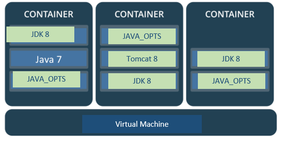

 
* ```role```:         always remain application. This will run the application playbook, you will need application role to run this playbook.
* ```java```:         put the correct release_version of jdk we want to use, make sure jdk is present at **_/usr/local/java/_**
* ```tomcat```:       put the correct release_version of apache tomcat we want to use, make sure tomcat
               is present at **_/usr/local/tomcat/_**
* ```projectName```:  the name of the project(if project is made up of multiple module then name of the earFile/warFile). 
               ProjectName will be the user of the application ecosystem(container).
* ```projectContainer```:  This is a personal space for the app to hold its metadata(jdk, tomcat and its repository).
* ```projectGroup```: Every project falls into a group. For example: Test_abc, Test_abc_EFSBatch, Test_def.. falls into group of
               Test. Similarly cnn-podcast, cnn-stories, cnn-news.. falls into group of cnn. Ask your lead for the projectGroup
               name if you are not sure. ProjectGroup will be the group name of the application ecosystem(container).
* ```JAVA_OPTS```:    List all your JAVA_OPTS(no comma separated)  
* TODO: KeyStore at **_/tomcat/conf/server.xml_**  are they configured with NetScaler or loadBalancer or ... ? 
* TODO: We need to change permissions on file?

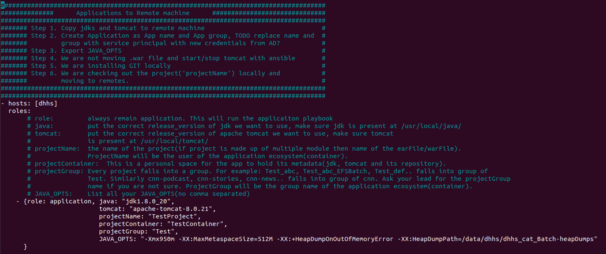


host files lives here
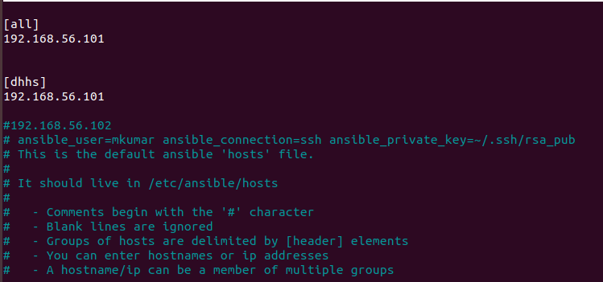


### The overall structure looks like


and


```
file: playbook.yaml
Directories:
  * roles (need for input to playbook)
  * group_vars (need for input to playbook)
  * /mkumar/ansible/ (created on control machine as output by playbook, it will be fed to remote vms)
      * repo
          * platform
              * projectContainer
                   * projectName
                        * Code from GIT server
  * /usr/local/appservers (created on controlled machine(remote) for output by playbook)
      * platform
          * projectContainer
                * projectName
                        * Code from GIT server
                        * jdk and tomcat directory as per playbook.
```


# How to run playbook

```
ansible-playbook disasterManagement.yaml -K
```
Where
```-K``` = ask for privilege escalation password.


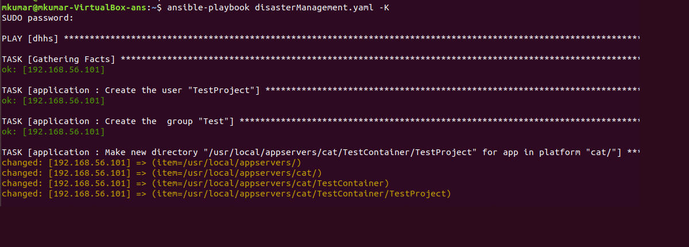


# output of playbook
```This is what resulted at Controlled machine(remote machine, where provisioning is being done).```

### **_/usr/local/appservers/_**
 
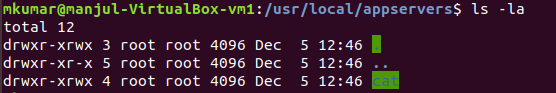


### **_/usr/local/appservers/platform/_**
 
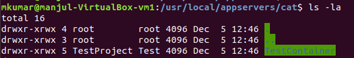


### **_/usr/local/appservers/platform/projectContainer/_**
  
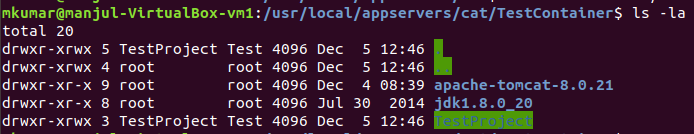

### **_/usr/local/appservers/platform/projectContainer/projectName/_**
  
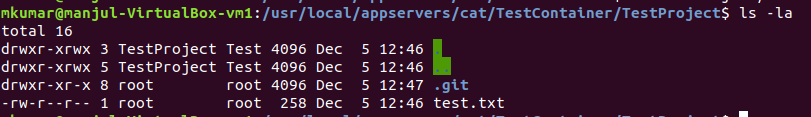


```This is what resulted at Control machine(localhost machine, where ansible is running).```

### **_/mkumar/ansible/_**
 
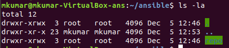

### **_/mkumar/ansible/repo/_**
 
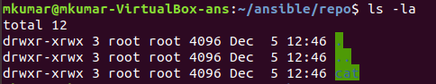

### **_/mkumar/ansible/repo/platform/_**
 
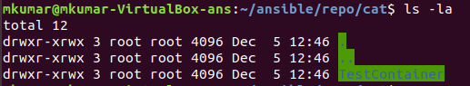

### **_/mkumar/ansible/repo/platform/projectContainer/_**
 
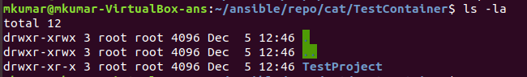

### **_/mkumar/ansible/repo/platform/projectContainer/projectName/_**
 
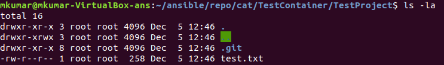
